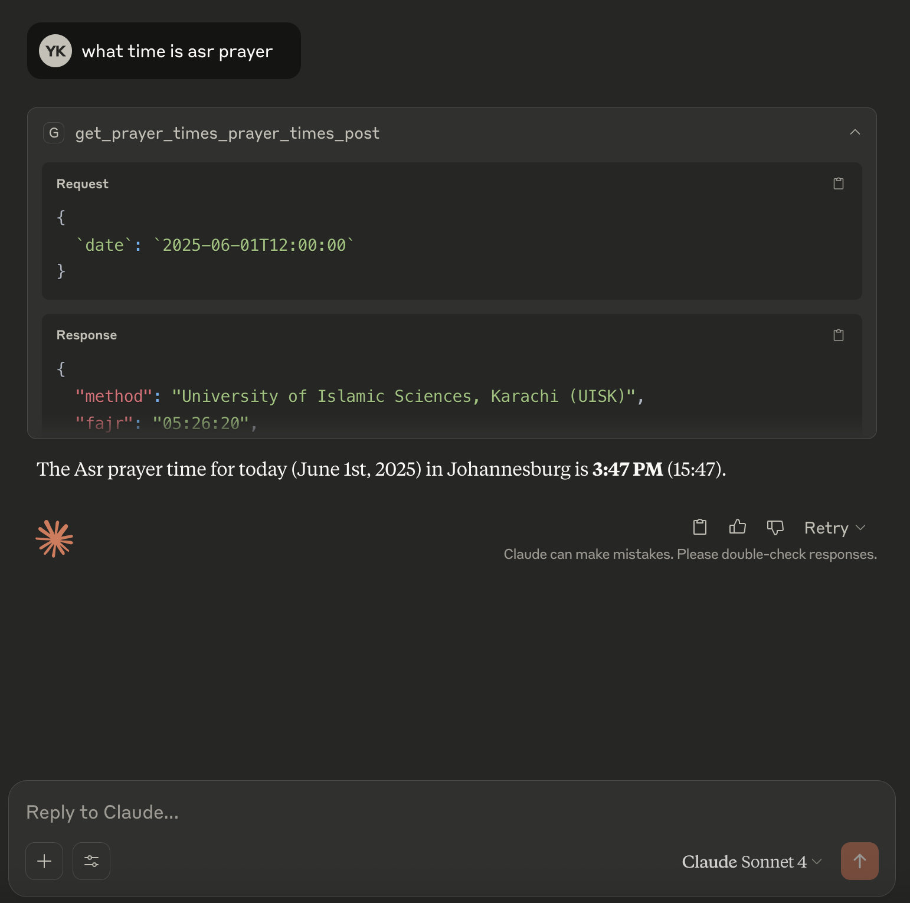

# Salaah MCP (Muslim Community Prayer Times)

A FastAPI and MCP service providing Islamic prayer times calculations using the [islamic_times](https://github.com/hassantahan/islamic_times) library.



## Dependencies

This project relies on the following main dependencies:
- [FastAPI](https://fastapi.tiangolo.com/): Web framework for building APIs
- [FastAPI MCP](https://github.com/tadata-org/fastapi_mcp): Model Control Protocol
- [islamic_times](https://github.com/hassantahan/islamic_times): Core calculation engine for prayer times
- Pydantic: Data validation

## Installation

1. Clone the repository:
```bash
git clone https://github.com/yourusername/salaah-mcp.git
cd salaah-mcp
```

2. Install uvv and dependencies:
```bash
pip install uv
uv install
```

## Usage

```bash
uv run run.py
```

The API will be available at:
- Development: http://localhost:8000
- Production: http://localhost:8000 (configurable via UVV_PORT environment variable)

## API Endpoints

### Calculate Prayer Times

`POST /prayer_times`

Calculate prayer times for a given location and date.

Example request:
```json
{
  "latitude": -26.1528113,
  "longitude": 28.0049996,
  "method": "EGYPTIAN"
}
```

Example response:
```json
{
  "method": "Egyptian General Authority of Survey (Egypt)",
  "fajr": "2025-06-01T05:19:11.373053+02:00",
  "sunrise": "2025-06-01T06:47:44.369263+02:00",
  "zuhr": "2025-06-01T12:05:43.358460+02:00",
  "asr": "2025-06-01T15:23:52.560113+02:00",
  "sunset": "2025-06-01T17:23:52.560113+02:00",
  "maghrib": "2025-06-01T17:23:52.560113+02:00",
  "isha": "2025-06-01T18:43:09.341111+02:00",
  "midnight": "2025-06-02T00:06:02.228763+02:00"
}
```

### Get Qiblah Direction

`POST /qiblah`

Get Qiblah direction and distance from any location.

```json
{
  "latitude": -26.1528113,
  "longitude": 28.0049996,
  "date": "2025-06-01T00:00:00Z"
}
```

Example response:
```json
{
  "distance_km": 5452,
  "distance_mi": 3388,
  "direction": "NNE",
  "angle_decimal": 14.647,
  "angle_dms": "014° 38′ 49.84″"
}
```

### Get Sun Information

`POST /sun`

Get detailed sun position and timing information.

Example response:
```json
{
  "sunrise": "2025-06-01T06:47:40",
  "transit": "2025-06-01T12:05:33",
  "sunset": "2025-06-01T17:23:36",
  "apparent_altitude": -42.659,
  "apparent_azimuth": 276.796,
  "distance_au": 1.014106,
  "apparent_declination": 22.166,
  "apparent_right_ascension": "04h 39m 56.17s",
  "greenwich_hour_angle": 99.904,
  "local_hour_angle": 127.951
}
```

### Get Moon Information

`POST /moon`

Get detailed moon position and phase information.

Example response:
```json
{
  "moonrise": "2025-06-01T11:39:22",
  "transit": "2025-06-01T16:25:15",
  "moonset": "2025-06-01T22:54:19",
  "illumination": 36.38,
  "apparent_altitude": 25.803,
  "azimuth": 305.203,
  "distance_km": 388391,
  "parallax": 0.941,
  "topocentric_declination": 15.892,
  "topocentric_right_ascension": "09h 52m 04.77s",
  "greenwich_hour_angle": 21.198,
  "local_hour_angle": 49.245
}
```

### Calculate Moon Visibility

`POST /moon/visibility`

Calculate new moon visibility using Yallop's criterion.

```json
{
  "latitude": -26.1528113,
  "longitude": 28.0049996,
  "date": "2025-05-27T00:00:00Z",
  "days": 3,
  "criterion": 1
}
```

Example response:
```json
[
  {
    "criterion": "Yallop",
    "date": "2025-05-27T15:28:52",
    "value": -0.788,
    "description": "F: Not visible; below the Danjon limit."
  },
  {
    "criterion": "Yallop",
    "date": "2025-05-28T15:56:44",
    "value": 0.958,
    "description": "A: Easily visible."
  }
]
```

## Available Calculation Methods

- ISNA: Islamic Society of North America
- MWL: Muslim World League
- UMM_AL_QURA: Umm al-Qura University, Makkah
- EGYPTIAN: Egyptian General Authority of Survey
- KARACHI: University of Islamic Sciences, Karachi
- TEHRAN: Institute of Geophysics, University of Tehran
- JAFARI: Shia Ithna Ashari, Leva Research Institute, Qom

## Claude Desktop Integration

To use the prayer times service with Claude Desktop:

1. Create a configuration file:
```json
{
  "mcpServers": {
    "Salaah Times": {
      "command": "/Users/yusuf/.local/bin/mcp-proxy",
      "env": {
        "SSE_URL": "http://localhost:8000/mcp"
      }
    }
  }
}
```

2. Save this as `claude_desktop_config.json` in your Claude Desktop configuration directory.

3. Make sure the MCP service is running:
```bash
uv run run.py
```

4. Start Claude Desktop and you can now ask questions about prayer times like:
- "What time is Asr prayer today?"
- "When is Fajr tomorrow in Johannesburg?"
- "Show me all prayer times for London"

The AI will use the MCP service to calculate accurate prayer times based on your queries.
